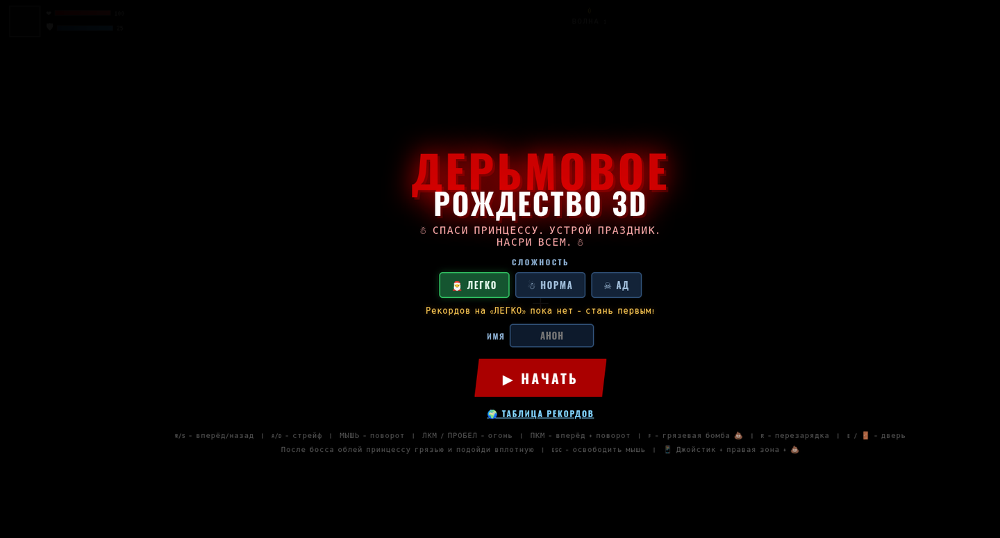
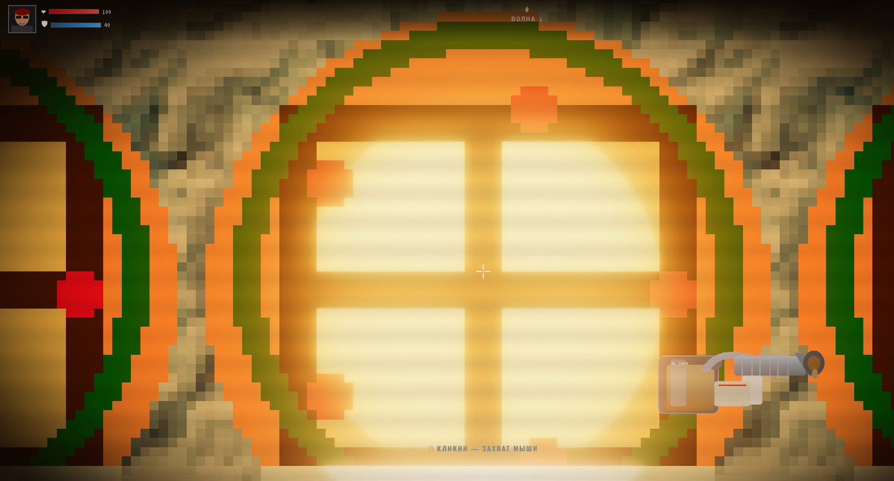
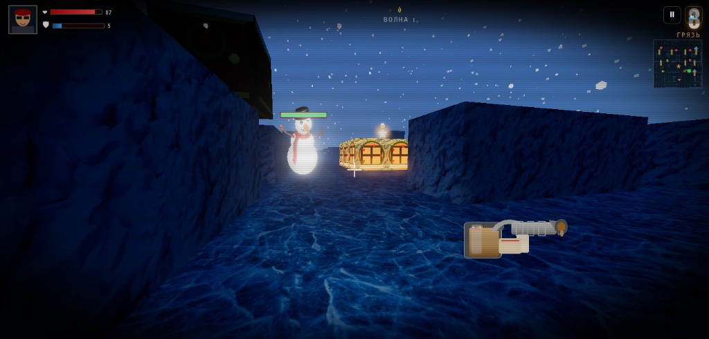
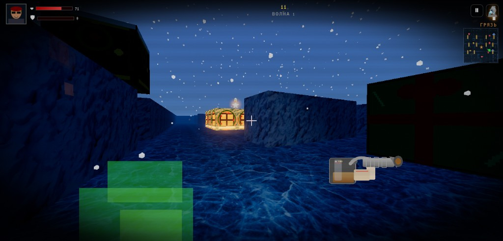

# Дерьмовое Рождество 3D

**Crappy Christmas** — браузерный 3D-шутер про спасение принцессы гряземётом. Без сборки, без npm: открыл в браузере и играешь.

<p align="center">
  <a href="https://costamika.github.io/crappyChristmas/"></a>
</p>

<p align="center">
  <a href="https://costamika.github.io/crappyChristmas/"></a>
</p>

<p align="center">
  <em>Спаси принцессу. Устрой праздник. Насри всем.</em>
</p>

<p align="center">
  <a href="LICENSE"></a>
  
  
</p>

## Скриншоты

<p align="center">
  
</p>

<p align="center">
  
</p>

<p align="center">
  
</p>

Рождественский рынок, ледяные казармы и камера Мега-Санты — всё в одном файле и папке текстур.

## Сюжет

Четыре волны снеговиков, эльфов и морковных стрелков. Потом босс **Мега-Санта**. Потом принцесса: облей её грязью и подойди вплотную — иначе победы не будет.

По дороге: секретные стены, второй гряземёт, домик эльфов, который лучше не трогать без нужды.

## Управление

| | ПК | Телефон |
| --- | --- | --- |
| Ходьба | `WASD` | левая половина экрана |
| Обзор | мышь | свайп по правой половине (вверх/вниз тоже) |
| Огонь | ЛКМ / пробел | кнопка 💩 |
| Грязевая бомба | `F` | кнопка 💣 |
| Перезарядка | `R` | ↺ |
| Дверь | `E` | 🚪 |
| Пауза | `P` / кнопка | кнопка паузы |

Сложность: **Легко / Норма / Ад**. Комбо с третьего килла подряд даёт ×2 к очкам.

## Как запустить

Онлайн: **[играть на GitHub Pages](https://costamika.github.io/crappyChristmas/)** (таблица рекордов — локальная, без PHP).

На телефоне «Начать» просит полный экран (Android). На iPhone адресная строка Safari не скрывается полностью — кнопка ⛶ или «На экран Домой» дают настоящий полный кадр.

На своём компьютере:

```bash
python3 -m http.server 8765
```

Дальше: [http://127.0.0.1:8765/](http://127.0.0.1:8765/)

Three.js уже лежит в `vendor/three/`, интернет для движка не нужен.

### Таблица рекордов

- Без PHP результаты пишутся в браузер (`localStorage`) — офлайн-таблица.
- С PHP рядом кладётся `stats.php`: онлайн-топ по сложностям, SQLite.

## Из чего состоит

```
index.html      игра
stats.php       лидерборд (необязательно)
textures/       стены, враги, небо
sounds/         выстрелы и шаги
vendor/three/   локальная копия Three.js
```

Лицензия: [Apache 2.0](LICENSE).
